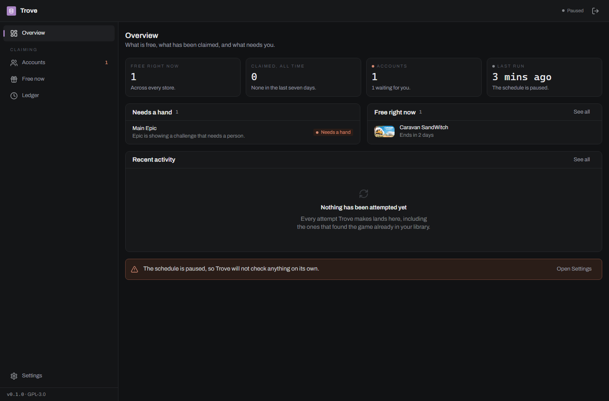
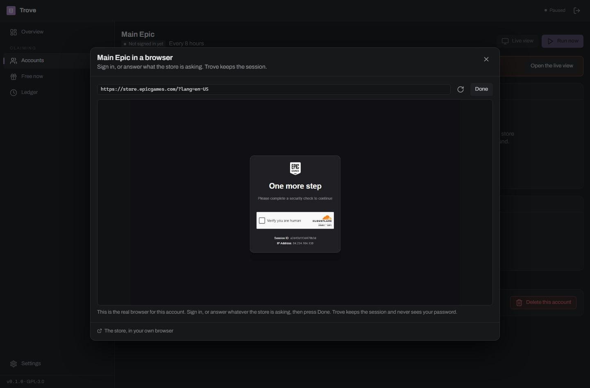
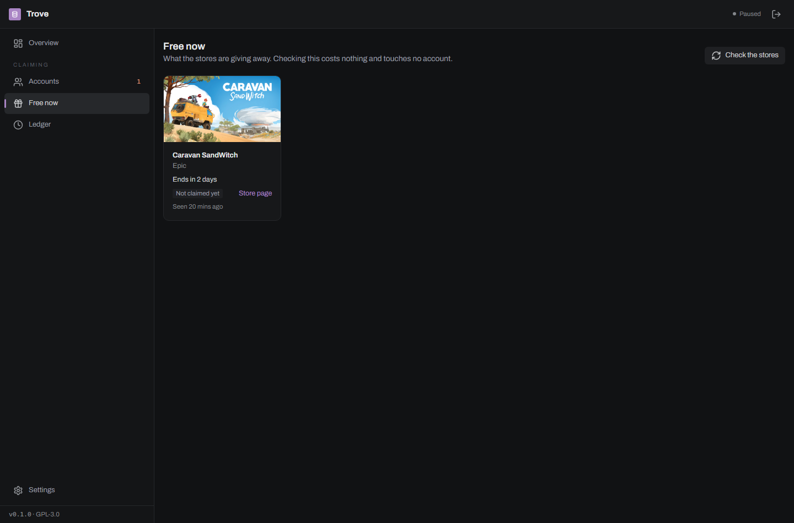
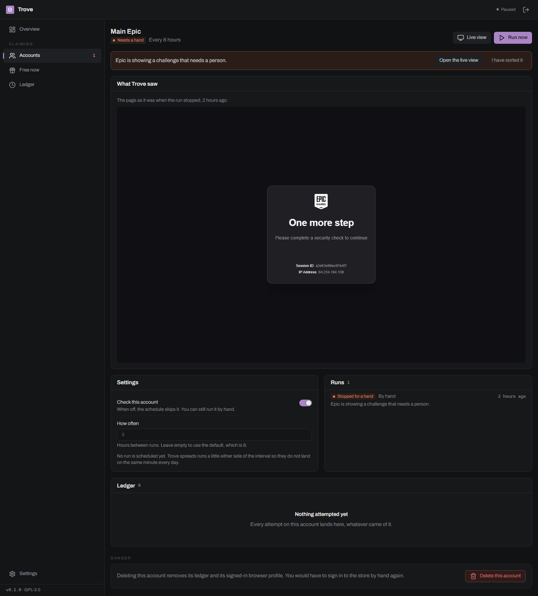
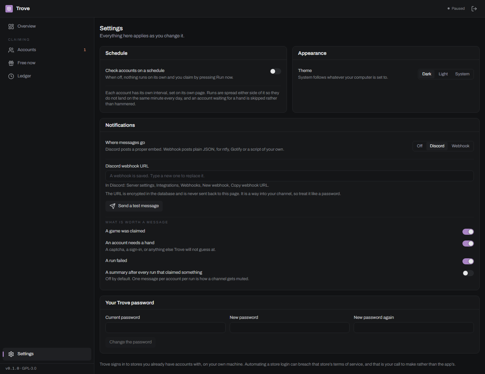
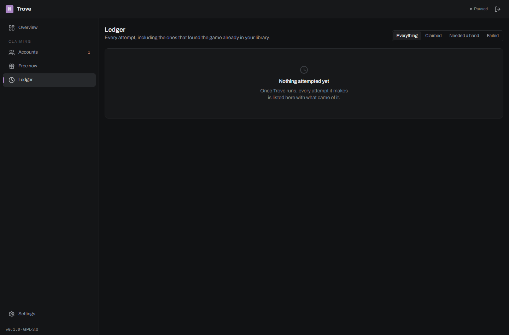

<h1 align="center">Trove</h1>

<p align="center">
  A self-hosted claimer for the games that are <b>temporarily free</b> on stores you already have accounts with.<br>
  Epic Games Store · one browser profile per account · a ledger of every attempt · Discord or webhook notifications
</p>



> **Early days.** One store works end to end (Epic), the interface is complete,
> and the sign-in and challenge flow has been used against the real store. The
> claim step itself has not yet been run against a signed-in Epic account, so
> its page selectors are unproven. See [what is not there yet](#what-is-not-there-yet).

## What it does

Trove signs in to your own store accounts on your own machine, on a schedule,
and claims what is being given away. It keeps a browser profile per account
rather than a password, so a healthy account signs in once by hand and never
again.

When a store asks a question it cannot answer, it stops and asks you.

## Install

```yaml
services:
  trove:
    image: ghcr.io/spillebulle/trove:latest
    container_name: trove
    restart: unless-stopped
    ports:
      - "8080:8080"
    volumes:
      - ./data:/data
    environment:
      - ADMIN_PASSWORD=pick-something
      - PUID=1000
      - PGID=1000
      - TZ=Europe/Oslo
    shm_size: 1gb
```

`docker compose up -d`, then open `http://localhost:8080` and sign in as
`admin`. The same image is on Docker Hub as `spillebulle/trove` if you prefer
it. Images are `linux/amd64` only, because the image installs real Google
Chrome and Google ships no Chrome for Linux on arm64, and they are published
from `v*` tags only - there is no build from the tip of main. The image carries a real Chrome, so it is around 2 GB and wants
`shm_size: 1gb`; below about 512 MB Chrome crashes part-way through a store
page. Everything else, including the two encryption keys, is generated into
`./data` on the first start. Back that directory up and you have backed up your
signed-in sessions.

> **The container cannot do the first sign-in.** It has no screen you can see,
> so "Sign in here" is refused there, and a captcha can refuse the live view
> too. Sign in on a desktop and copy `data/profiles/<id>-<slug>/` into the
> container's volume, then press "Check again" on the account. Everything after
> that - the schedule, claiming, the ledger, notifications - runs in the
> container normally.
>
> The Docker image has never been built or run. Expect to debug the first one.

## Signing in, once



**Sign in here** opens the account's profile in an ordinary Chrome window on
the machine Trove is running on, with no automation attached to it whatsoever.
You sign in as you normally would, close the window, and Trove reuses that
session from then on. This is the way in, because a captcha will not accept an
answer from a browser it can tell is being driven.

The live view above is the fallback for when Trove is on another machine: the
account's browser, streamed into the page. It is fine for looking and for
simple sign-ins, but a store that puts up an interactive captcha may refuse it
no matter how honestly you click.

Trove never asks for a store password, and there is nowhere to put one.

**It needs real Google Chrome.** Playwright's bundled Chromium ships without
H.264, HEVC and AAC while telling every site it is Chrome, and Cloudflare's
captcha probes for exactly those codecs. On the bundle the checkbox spins and
resets forever, however honestly you click it. The Docker image installs Chrome
itself; on a desktop install, have Chrome installed or run `playwright install
chrome`. Trove picks it up on its own and logs which browser it drove.

## What is free



Finding out what is free costs one request to a public endpoint and touches no
account, so it happens whether or not anything is signed in. The browser only
wakes up when there is something to claim.

## When something needs you



A run that meets a captcha, a sign-in or a changed page stops, screenshots what
it saw, and marks the account. It does not retry, and it does not move on to
the next game: whatever asked the question will ask it again. Getting an
account flagged is a worse outcome than missing a free game.

## Notifications



Discord gets a proper embed with a colour per severity. Anything else gets flat
JSON (`app`, `title`, `message`, `severity`, `context`, `url`), which ntfy,
Gotify or a script of your own can read without Trove pretending to know their
formats. There is a test button, and the webhook is encrypted at rest and never
sent back to the browser.

## The ledger



Every attempt is a row, including the ones that found the game already in your
library, which is most of them after the first week. Trove never claims a game
it cannot show you a row for. Keys, where a store hands one out instead of
adding to a library, are encrypted and revealed one at a time.

## What is not there yet

| | |
|---|---|
| **Epic claiming, proven** | Discovery is verified against Epic's live endpoint. The checkout flow is written but its selectors have not been run against a signed-in account, so the first real claim may need them corrected. They are all in one table at the top of `backend/app/adapters/epic.py`. |
| **Other stores** | Prime Gaming, GOG, Steam, EA and Ubisoft are designed for and not written. One store had to work end to end first. |
| **The public giveaway feed** | The setting exists and is off. GamerPower is the obvious candidate and its terms have not been checked. |
| **TOTP** | An account can store a secret, encrypted, but nothing types a code with it yet. |
| **Tests** | There is no test suite. The flows in this README were verified by driving the running app. |

## Configuration

| Variable | Default | What it is |
|---|---|---|
| `ADMIN_PASSWORD` | `changeme` | The password for Trove itself. Set it before the first start. |
| `DATA_DIR` | `/data` | Database, browser profiles, screenshots, generated keys. |
| `DEFAULT_INTERVAL_HOURS` | `8` | How often an account is checked, unless it sets its own. |
| `TROVE_HEADLESS` | `false` | Headed is the default because headless is a signal bot detection reads. |
| `BROWSER_CHANNEL` | `auto` | Drives real Google Chrome when it is there. Leave it alone: see below. |

Everything else is in [`.env.example`](.env.example), commented.

## Building from source

```powershell
# Backend
python -m venv backend/.venv
backend/.venv/Scripts/pip install -r backend/requirements.txt
backend/.venv/Scripts/python -m playwright install chromium
# Real Chrome. Skip this and captchas cannot be answered - see the note above.
backend/.venv/Scripts/python -m playwright install chrome
$env:DATA_DIR="./data"; backend/.venv/Scripts/python -m uvicorn app.main:app --app-dir backend --reload --port 8080

# Frontend, in a second terminal
cd frontend; npm install; npm run dev
```

## Licence

GPL-3.0. Archivo is bundled under the SIL Open Font Licence 1.1; icons are
[Lucide](https://lucide.dev) (ISC).

---

Trove automates logins to stores you already have accounts with, on your own
machine, for your own accounts. That can breach a store's terms of service.
It is your call to make, and the app is built to be quiet about it: polite
intervals, one attempt, no captcha solving, and no credential it could replay.
